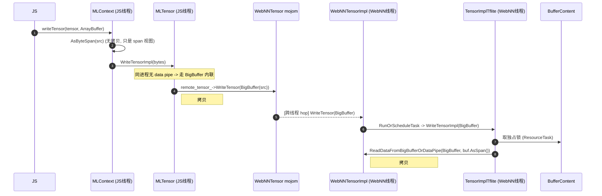
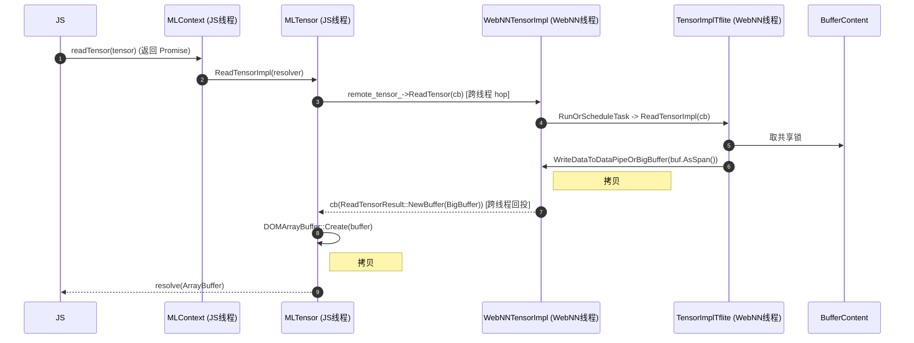
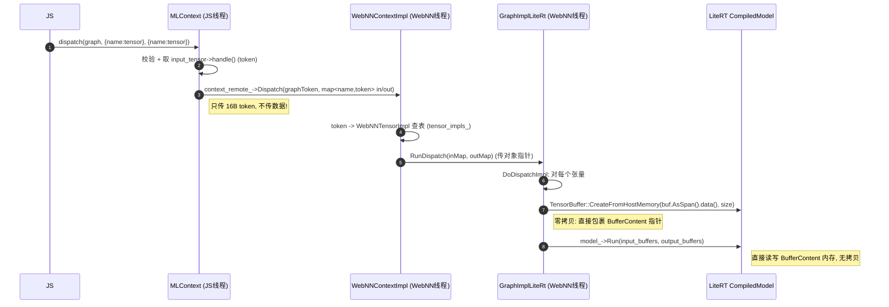

# WebNN LiteRT(渲染进程内) Tensor 读写路径分析与推理时延优化设计

> 目标：优化 **LiteRT backend in renderer process** 路径的推理时延。
> 核心思路（用户提出）：不用 mojom 传递 input/output tensor，减少推理时的数据拷贝。
>
> 本文先完整梳理当前 WebNN 的 write/read/dispatch tensor 设计（调用栈、类图、数据拷贝点），
> 再据此给出可落地的优化方案。
>
> 代码基线：`/home/junwei/workspace/chromium/src`（分析于 2026-07）。

---

## 0. 结论速览（TL;DR）

| 结论 | 说明 |
|---|---|
| **`dispatch()` 本身不拷贝张量数据** | mojom 只传 `WebNNTensorToken`（16 字节 UnguessableToken），服务端用 token 查到已存在的 `WebNNTensorImpl` 对象。见 `webnn_context.mojom:63`。 |
| **推理(Invoke)本身已是零拷贝** | LiteRT 用 `TensorBuffer::CreateFromHostMemory()` 直接**包裹** WebNN 张量内存指针，`model_->Run()` 直接读写该内存，无中间拷贝。见 `graph_impl_litert.cc:306-331`。 |
| **真正的开销在 `writeTensor` / `readTensor`** | 每次都经 mojom `WebNNTensor` 接口用 `BigBuffer` 搬运数据，**即使在渲染进程内（同进程）也发生：一次跨线程 hop + 双次 memcpy**。 |
| **用户"去掉 mojom 传 tensor"的表述需修正** | 需要优化的不是 `dispatch`（它没传数据），而是 `writeTensor`/`readTensor` 的 `BigBuffer` 通道。正确的落地手段是：**让 tensor 后备存储改用可共享内存 / 直接暴露给 Blink，绕过 BigBuffer 双拷贝**。 |
| **每次推理的张量数据 memcpy 次数（1 in + 1 out）** | 当前 ≈ **4 次**（write 2 次 + read 2 次）+ mojom 序列化 + 跨线程调度；理论下界可降到 **1 次**（甚至对 write 可做到 0 次）。 |

---

## 1. 整体架构与分层

WebNN 有两条后端部署形态：
- **GPU 进程后端**：当 ChromeML 的 GPU delegate 可用时走 GPU 进程（`gpu_task_scheduler_` 非空）。
- **渲染进程内后端（本文重点）**：CPU / NPU，或 GPU delegate 不可用时的 fallback。由
  `webnn_context_provider_in_renderer.cc` 创建，所有 WebNN 服务对象都在**渲染进程**内，但运行在
  一个**专用 ThreadPool 单线程 TaskRunner** 上，与 JS 线程隔离。

判定逻辑：`webnn_context_provider_impl.cc:120-131 ShouldUseInProcessTflite()` →
GPU delegate 不可用则返回 true → fallback 到渲染进程内 TFLite/LiteRT。

### 1.1 关键类与所属层（类图）

```mermaid
classDiagram
    direction LR

    %% ---- Blink (renderer, JS 线程) ----
    class MLContext {
        +writeTensor(tensor, data)
        +readTensor(tensor) Promise
        +dispatch(graph, inputs, outputs)
        -HeapMojoRemote~WebNNContext~ context_remote_
        -DataPipeProducer write_tensor_producer_
        -DataPipeConsumer read_tensor_consumer_
    }
    class MLTensor {
        -HeapMojoAssociatedRemote~WebNNTensor~ remote_tensor_
        -WebNNTensorToken webnn_handle_
        +WriteTensorImpl(bytes)
        +ReadTensorImpl(...)
        +handle() WebNNTensorToken
    }
    class MLGraph {
        -WebNNGraphToken graph_token_
    }

    %% ---- mojom 边界 ----
    class WebNNContext_mojom {
        <<interface>>
        CreateTensor(info, data)
        Dispatch(graphToken, inMap, outMap)
    }
    class WebNNTensor_mojom {
        <<interface>>
        WriteTensor(BigBuffer src)
        ReadTensor()
    }

    %% ---- Service (渲染进程内, WebNN 专用线程) ----
    class WebNNContextImpl {
        +Dispatch(...)
        +CreateTensor(...)
        +RunOrScheduleTask(task)
        +ReadDataFromBigBufferOrDataPipe(BigBuffer, span)
        +WriteDataToDataPipeOrBigBuffer(span) BigBuffer
        -map~token, WebNNTensorImpl~ tensor_impls_
        -map~token, WebNNGraphImpl~ graph_impls_
    }
    class WebNNTensorImpl {
        <<abstract>>
        +WriteTensor(BigBuffer)
        +ReadTensor(cb)
        +WriteTensorImpl()*
        +ReadTensorImpl()*
    }
    class WebNNGraphImpl {
        <<abstract>>
        +RunDispatch(inMap, outMap)
        +DispatchImpl()*
    }

    %% ---- TFLite / LiteRT 后端 ----
    class TensorImplTflite {
        -QueueableResourceState~BufferContent~ buffer_state_
        +WriteTensorImpl(BigBuffer)
        +ReadTensorImpl(cb)
    }
    class BufferContent {
        -void* buffer_
        -size_t size_
        +AsSpan() span
    }
    class GraphImplLiteRt {
        -litert::CompiledModel model_
        -litert::Environment env_
        +DispatchImpl(inMap, outMap)
        +DoDispatchImpl(...)
    }

    MLContext --> MLTensor
    MLContext --> MLGraph
    MLContext ..> WebNNContext_mojom : context_remote_
    MLTensor ..> WebNNTensor_mojom : remote_tensor_
    WebNNContext_mojom <|.. WebNNContextImpl
    WebNNTensor_mojom <|.. WebNNTensorImpl
    WebNNContextImpl --> WebNNTensorImpl
    WebNNContextImpl --> WebNNGraphImpl
    WebNNTensorImpl <|-- TensorImplTflite
    WebNNGraphImpl <|-- GraphImplLiteRt
    TensorImplTflite --> BufferContent
    GraphImplLiteRt ..> BufferContent : CreateFromHostMemory(零拷贝)
```



### 1.2 张量后备存储：`BufferContent`

每个 WebNN 张量的实际内存是一块**堆上、对齐、带 padding 的缓冲**：

`buffer_content_tflite.cc:32-42`
```cpp
BufferContent::BufferContent(size_t size)
    : buffer_(base::AlignedAlloc(AddPaddingIfNecessary(size),
                                 ::tflite::kDefaultTensorAlignment)),
      size_(size), allocated_size_(AddPaddingIfNecessary(size)) {
  // XNNPACK delegate 会越界读，故整块（含 XNN_EXTRA_BYTES padding）清零
  UNSAFE_BUFFERS(memset(buffer_.get(), 0, allocated_size_));
}
```
特点：`kDefaultTensorAlignment` 对齐、`XNN_EXTRA_BYTES` padding、全零初始化。
被 `QueueableResourceState<BufferContent>` 包裹以做读写并发排队（读共享锁 / 写独占锁）。

---

## 2. 写张量 `writeTensor` 调用栈与拷贝点

### 2.1 时序（渲染进程内）



### 2.2 关键代码

- Blink 入口：`ml_context.cc:1579-1613 MLContext::writeTensor()` →
  `bytes = AsByteSpan(*src_data)`（无拷贝）→ `dst_tensor->WriteTensorImpl(bytes,...)`。
- Blink → mojom：`ml_tensor.cc:314-344 MLTensor::WriteTensorImpl()`
  ```cpp
  if (ml_context_->write_tensor_producer() &&                 // 仅跨进程存在
      src_data.size() > mojo_base::BigBuffer::kMaxInlineBytes &&
      producer->WriteAllData(src_data) == MOJO_RESULT_OK) {
    remote_tensor_->WriteTensor({});                           // data pipe 路径
  } else {
    remote_tensor_->WriteTensor(src_data);                    // ★ 渲染进程内走这里：拷贝#1
  }
  ```
  **在渲染进程内 `write_tensor_producer()` 为空**（见 `webnn_context_provider_in_renderer.cc:112-116` data pipe 传空），
  因此总是走 `WriteTensor(src_data)` 内联 BigBuffer。
- mojom：`webnn_tensor.mojom:50` `WriteTensor(mojo_base.mojom.BigBuffer src_buffer);`
- 服务端派发：`webnn_tensor_impl.cc:88-119 WebNNTensorImpl::WriteTensor()` 校验 `kWrite` usage、
  size、未导出，`RunOrScheduleTask` → 后端 `WriteTensorImpl`。
- 后端拷贝：`tensor_impl_tflite.cc:98-133` → `webnn_context_impl.cc:430-444`
  ```cpp
  void WebNNContextImpl::ReadDataFromBigBufferOrDataPipe(BigBuffer src, span<uint8_t> dst){
    if (src.size()==0) { /* data pipe，仅跨进程 */ }
    else dst.copy_from(src);   // ★ 拷贝#2
  }
  ```

**渲染进程内 write 净拷贝 = 2 次**（src→BigBuffer，BigBuffer→BufferContent）+ 跨线程 hop + mojom 序列化。

---

## 3. 读张量 `readTensor` 调用栈与拷贝点

### 3.1 时序



### 3.2 关键代码

- Blink：`ml_context.cc:1615-1671`（两个重载：新建 buffer / BYOB 写入已有 buffer）→
  `ml_tensor.cc:141-205 ReadTensorImpl()` → `remote_tensor_->ReadTensor(BindOnce(&OnDidReadTensor,...))`。
- mojom：`webnn_tensor.mojom:46` `ReadTensor() => (ReadTensorResult result);`，
  `ReadTensorResult { BigBuffer buffer; Error error; }`。
- 服务端：`webnn_tensor_impl.cc:58-86` → `tensor_impl_tflite.cc:55-96` →
  `webnn_context_impl.cc:446-454`
  ```cpp
  BigBuffer WebNNContextImpl::WriteDataToDataPipeOrBigBuffer(span<const uint8_t> src){
    if (read_tensor_producer_ && src.size()>kMaxInlineBytes && ...) return BigBuffer(); // 跨进程
    return mojo_base::BigBuffer(src);   // ★ 拷贝#1（渲染进程内走这里）
  }
  ```
- 回到 Blink：`ml_tensor.cc:207-312 OnDidReadTensor / OnDidReadTensorByob`
  ```cpp
  resolver->Resolve(DOMArrayBuffer::Create(result->get_buffer())); // ★ 拷贝#2
  // 或 BYOB: bytes.copy_prefix_from(result->get_buffer());        // ★ 拷贝#2
  ```

**渲染进程内 read 净拷贝 = 2 次**。

---

## 4. `dispatch` 调用栈（对比：无数据拷贝）



关键：
- `ml_context.cc:1712-1759`：取 `input_tensor->handle()`（`WebNNTensorToken`）放入 map，
  `context_remote_->Dispatch(graph_token, mojo_inputs, mojo_outputs)`。
- `webnn_context.mojom:63-65`：`Dispatch(graphToken, map<string, WebNNTensorToken> in, out)`。
- `webnn_context_impl.cc:558-641 Dispatch()`：token 查 `tensor_impls_` / `graph_impls_`，
  `graph_impl->RunDispatch(...)`（`webnn_graph_impl.cc:85-127`）。
- **LiteRT 零拷贝推理**：`graph_impl_litert.cc:292-343 DoDispatchImpl()`
  ```cpp
  ASSIGN_OR_RETURN(auto litert_buffer,
      ::litert::TensorBuffer::CreateFromHostMemory(
          *env_, input_tensor_types[i],
          buffer->AsSpan().data(), buffer->AllocatedSize()));  // 包裹, 不拷贝
  ...
  auto status = model_->Run(input_buffers, output_buffers);    // 直接算
  ```
  （对比：非 LiteRT 的 `graph_impl_tflite.cc` 用 `SetCustomAllocationForTensor()` 达到同样零拷贝。）

**因此推理热路径上真正的浪费不在 `dispatch`，而在每帧前后的 `writeTensor` / `readTensor`。**

---

## 5. 渲染进程内路径的进程/线程模型（优化可行性基础）

| 事实 | 依据 |
|---|---|
| WebNNContextImpl / TensorImplTflite / GraphImplLiteRt 均在**渲染进程** | `webnn_context_provider_in_renderer.cc` 创建 |
| 后端跑在**专用 ThreadPool 单线程 TaskRunner**，非 JS 线程 | `webnn_context_provider_in_renderer.cc:55-58` `CreateSingleThreadTaskRunner(...)` |
| mojo receiver 绑定到该 owning_task_runner | `webnn_context_impl.cc:137-140` |
| 每个 `WriteTensor/ReadTensor/Dispatch` 从 JS 线程到 WebNN 线程有一次**跨线程 hop** | mojo 消息入队到 owning_task_runner |
| 渲染进程内**不创建 data pipe**（tensor 传输一律走 BigBuffer 内联/共享内存） | `webnn_context_provider_in_renderer.cc:112-116` 传空 producer/consumer |
| 同进程 → 无跨进程序列化，但 BigBuffer 仍需 **memcpy** 过线程边界 | `ReadDataFromBigBufferOrDataPipe` / `WriteDataToDataPipeOrBigBuffer` |

**含义**：由于是同进程，`BufferContent` 的地址在渲染进程内对 Blink 也是可寻址的——这为"共享内存/直接暴露 buffer"给出了物理可行性；难点在于**跨线程同步**与**JS 内存生命周期（ArrayBuffer detach / 对齐 / padding）**。

---

## 6. 数据拷贝总账（1 输入 + 1 输出，一次推理）

```
当前 (in-renderer):
  writeTensor: ArrayBuffer --copy#1--> BigBuffer --[thread hop]--copy#2--> BufferContent(input)
  dispatch   : token 传递 (0 拷贝)；LiteRT 包裹 BufferContent (0 拷贝)；Run() (0 拷贝)
  readTensor : BufferContent(output) --copy#1--> BigBuffer --[thread hop]--copy#2--> DOMArrayBuffer
  --------------------------------------------------------------
  张量数据 memcpy 合计 = 4 次  + 2 次跨线程调度 + mojom 序列化
```

推理本身（`Run`）零拷贝，**说明优化空间全部集中在 I/O 边界的 4 次拷贝**。对于逐帧实时推理（如视频、音频、
交互式模型），这 4 次拷贝 + 线程调度会显著抬高端到端时延与 CPU 占用。

---

## 7. 优化方案

> 用户原始表述"不用 mojom 传 input/output tensor"，应精确化为：
> **让 tensor 的后备存储改用可被 Blink 直接访问的（共享）内存，从而绕过 `WriteTensor/ReadTensor` 的 `BigBuffer` 双拷贝；`dispatch` 保持只传 token。**

按侵入度从低到高分三级，可分阶段落地。

### 方案 A（低风险，先做）：用共享内存承载 tensor，消除 BigBuffer 双拷贝

**做法**：`CreateTensor` 时，为渲染进程内路径把 `BufferContent` 建在一块
`base::UnsafeSharedMemoryRegion`（或渲染进程内可直接持有的 `WritableSharedMemoryMapping`）上，
并把该 region 的 handle 随 `CreateTensorSuccess` 返回给 Blink。之后：
- `writeTensor`：Blink 直接把 JS ArrayBuffer `memcpy` 进映射内存（**1 次拷贝**），
  只用一个**无 payload 的 mojom 信号**（或复用现有 `WriteTensor({})` 空 BigBuffer 语义）触发
  "数据已就绪 / 排队独占锁"。
- `readTensor`：后端算完后 Blink 直接从映射内存 `memcpy` 到 DOMArrayBuffer（**1 次拷贝**），
  同样只需一个完成信号。

**收益**：4 次 → 2 次拷贝；去掉 BigBuffer 的分配与序列化；跨线程只传信号不传数据。
**关键点/风险**：
- 同步：写入与推理、读取与推理之间的先后，仍复用现有 `QueueableResourceState` 独占/共享锁模型，
  Blink 在拿到"完成"回调前不得读；写入需在 dispatch 入队前完成（可用 fence/序号）。
- 对齐与 padding：共享内存需满足 `kDefaultTensorAlignment` 且预留 `XNN_EXTRA_BYTES`，
  映射给 JS 的可见长度应为逻辑 `size_`，padding 不暴露。
- 复用现有 `write_tensor_producer_/read_tensor_consumer_` data-pipe 抽象位点最小化改动面。

### 方案 B（中风险，收益更大）：把 tensor 存储直接暴露为 JS 可写 ArrayBuffer（write 零拷贝）

在方案 A 基础上，把映射内存**直接作为 MLTensor 的 JS 侧 backing store**（类似
`ArrayBufferContents` 包裹外部内存）。JS 侧 `writeTensor` 退化为"JS 直接写进张量内存"，
**write 拷贝降为 0**；`readTensor` 同理可让 JS 读视图直接映射输出张量内存（0 拷贝，
但需处理 detach / 只读 / 生命周期）。

**收益**：4 次 → 最少 1 次（甚至 0 次），并去掉大部分 mojom 往返。
**风险**：ArrayBuffer 的 neuter/detach 语义、`SharedArrayBuffer` 线程可见性、
张量在 dispatch 期间被 JS 改写的 TOCTOU 风险，需要严格的 usage flag（`kWrite`/`kRead`）与状态机约束。

### 方案 C（最激进）：JS ArrayBuffer 与 LiteRT interpreter 共用同一物理内存（端到端零拷贝）

因为 `dispatch` 阶段 LiteRT 已用 `CreateFromHostMemory` 直接包裹 `BufferContent`，
若方案 B 的映射内存就是 `BufferContent`，则形成 **JS 写 → LiteRT 读 → LiteRT 写 → JS 读** 全程零拷贝的闭环。

**风险**：最高。需要处理编译期 tensor 布局（量化/对齐/delegate 需求）、GPU delegate 情况下
host memory 不适用（GPU 需 AHWB/GL/WebGPU buffer，见 `CreateFromAhwb/CreateFromGlTexture/CreateFromWebGpuBuffer`），
以及跨线程的严格同步。建议仅在 CPU/XNNPACK 路径先启用，用 feature flag 灰度。

### 方案对比

| 方案 | 张量拷贝(1in+1out) | mojom 数据传输 | 改动面 | 风险 | 建议 |
|---|---|---|---|---|---|
| 当前 | 4 | BigBuffer×2 | — | — | 基线 |
| A 共享内存承载 | 2 | 仅信号 | 中小 | 低 | **优先落地** |
| B JS 直接写 tensor | 1（write=0） | 极少 | 中 | 中 | 二期 |
| C 端到端零拷贝(CPU) | 0 | 无 | 大 | 高 | flag 灰度 |

---

## 8. 落地建议（第一阶段 = 方案 A）

1. **加 feature flag**：如 `WebNNInRendererSharedTensor`，仅在渲染进程内 + CPU/NPU 路径生效，默认关。
2. **改 `CreateTensor` 契约**：`webnn_context_impl.cc:349-416 CreateTensor()` 在
   in-renderer 分支为张量分配 `UnsafeSharedMemoryRegion`；`CreateTensorSuccess`(见 `webnn_tensor.mojom` /
   `webnn_context.mojom`) 增加可选的 shared-memory handle 字段返回给 Blink。
3. **`BufferContent` 支持外部内存**：`buffer_content_tflite.*` 增加"用给定共享内存映射构造"的路径，
   保留对齐/padding 语义；`AsSpan()` 仍指向映射内存，`AllocatedSize()` 含 padding 供 XNN。
4. **改 `MLTensor` 读写**：`ml_tensor.cc` 在有 shared mapping 时，`WriteTensorImpl` 直接写映射、
   发空信号；`OnDidReadTensor` 直接读映射。落点复用现有 data-pipe 分支逻辑，减少 diff。
5. **同步与安全**：沿用 `QueueableResourceState` 排队；补充状态校验（写期间不可 dispatch、
   导出到 WebGPU 时禁用共享路径，见现有 `is_exported()` 检查）。
6. **基准**：用 `ScopedTrace`("Begin/End write/read"、"Run inference") 已有埋点，
   对比改造前后 `writeTensor`/`readTensor` 耗时与端到端 dispatch 时延（小张量看调度开销，
   大张量看 memcpy 带宽）。

---

## 9. 关键文件索引

| 层 | 文件 | 关键位置 |
|---|---|---|
| Blink | `third_party/blink/renderer/modules/ml/ml_context.cc` | writeTensor 1579、readTensor 1615、dispatch 1673 |
| Blink | `.../modules/ml/webnn/ml_tensor.cc` | WriteTensorImpl 314、ReadTensorImpl 141/170、OnDidReadTensor 207/253 |
| mojom | `services/webnn/public/mojom/webnn_tensor.mojom` | ReadTensor 46、WriteTensor 50 |
| mojom | `services/webnn/public/mojom/webnn_context.mojom` | CreateTensor、Dispatch 63 |
| Service | `services/webnn/webnn_context_impl.cc` | CreateTensor 349、Dispatch 558、Read/WriteData…Pipe 430/446、RunOrScheduleTask 695 |
| Service | `services/webnn/webnn_tensor_impl.cc` | ReadTensor 58、WriteTensor 88 |
| Service | `services/webnn/webnn_graph_impl.cc` | RunDispatch 85 |
| In-renderer | `services/webnn/webnn_context_provider_in_renderer.cc` | 线程 55-58、data pipe 置空 112-116 |
| 后端 | `services/webnn/tflite/tensor_impl_tflite.cc` | ReadTensorImpl 55、WriteTensorImpl 98 |
| 后端 | `services/webnn/tflite/buffer_content_tflite.cc` | 构造/对齐 32-42 |
| 后端 | `services/webnn/tflite/graph_impl_litert.cc` | DoDispatchImpl 292-343（零拷贝包裹）|
| 后端(对比) | `services/webnn/tflite/graph_impl_tflite.cc` | SetCustomAllocationForTensor 零拷贝 |

> 注：行号基于 2026-07 的本地代码快照，后续同步上游后可能有小幅漂移，定位以符号名为准。
